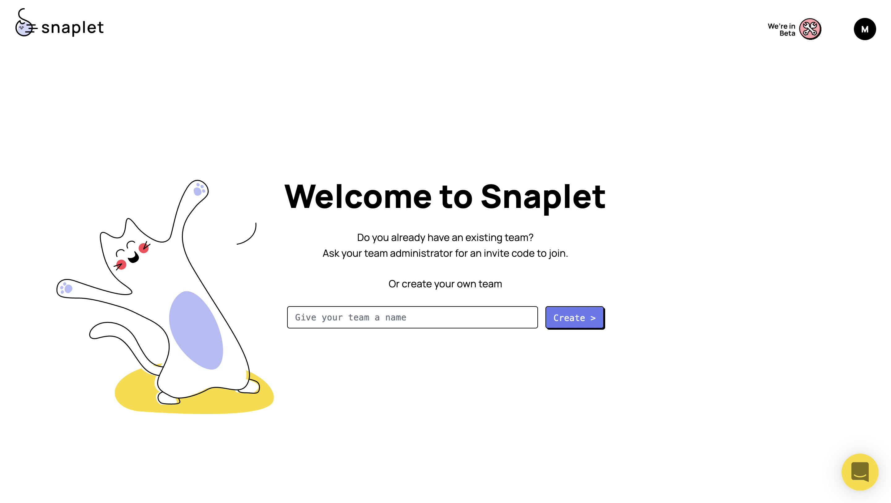
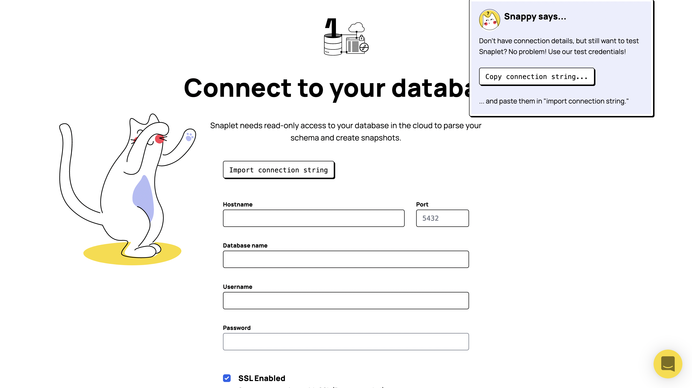
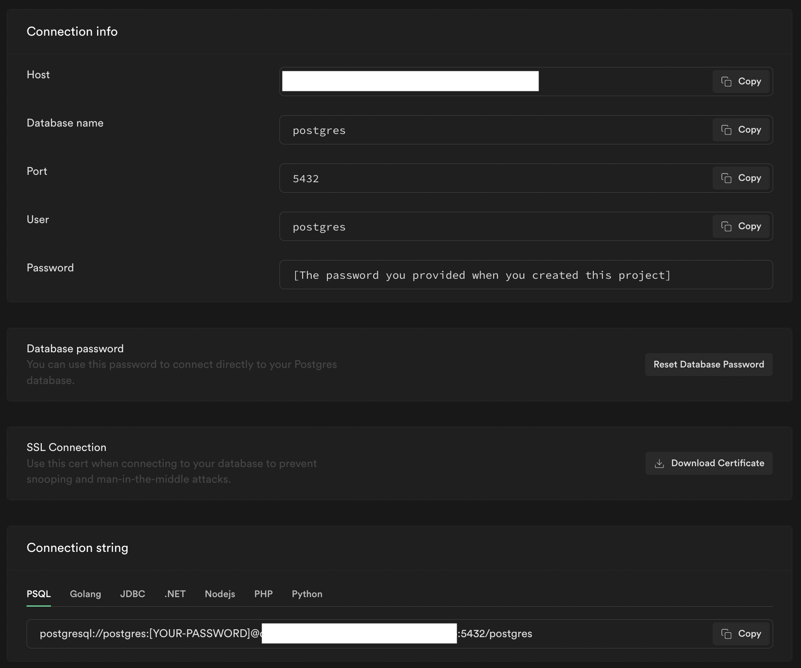
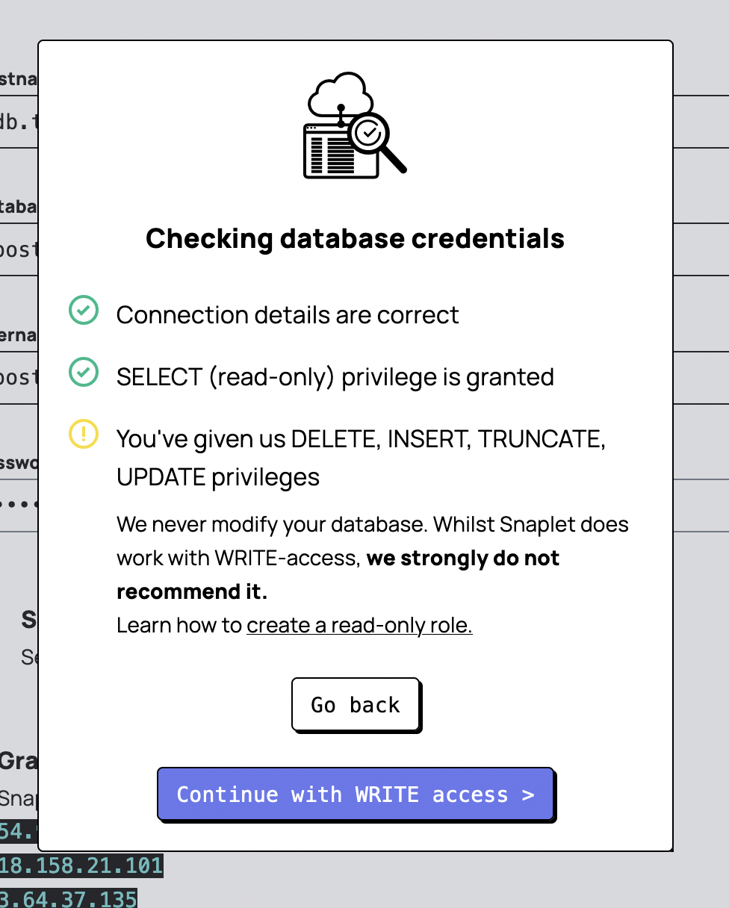
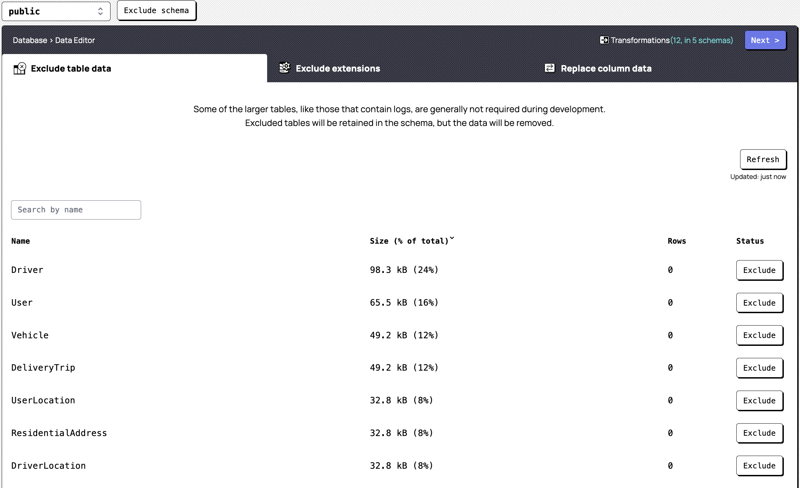

# Supabase Clone Environments

## Clone Supabase production data, without personal information, to a development environment

We're massive fans of [Supabase](https://supabase.com/) here at Snaplet, but as a Supabase user, you’ll know the pain and manual configuration in setting up multiple environments on Supabase, and populating each of those with data. Snaplet makes populating your multiple development environments with data, and keeping that data consistent across those environments, incredibly simple. This is rooted in a philosophy we believe in here at Snaplet: Environment parity.

"Environment parity" is a term introduced by ["The 12 Factor App Methodology"](https://12factor.net/dev-prod-parity) that instructed developers to keep our environments as similar as possible so that we could have the confidence that if it “worked on my machine,” it would work in production:

> If your development, testing, and production environments differ, even in ways you might think don’t matter, then you lose the ability to accurately predict how your code change is going to behave in production. This confidence in the code heading to production is essential for the kind of continuous delivery, rapid deployment that allows applications and their development teams to thrive in the cloud. – [Kevin Hoffman](https://www.oreilly.com/content/environment-parity-for-rapidly-deployed-cloud-native-apps/)

<div style={{textAlign: 'center'}}>


</div>

Environment parity sounds like a dream come true. In this guide, we’re going to tell you exactly how to do that with your data in Supabase! End-to-end, it shouldn’t take more than 15 minutes, and doing so will allow you to code against an accurate development environment that you can periodically sync with production. Chef's kiss!

You can follow along in the video below as our founder, Peter Pistorius takes you through the entire process, or refer to the written guide below.

<iframe src="https://www.youtube.com/embed/oPtMMhdhEP4?rel=0" frameborder="0" allow="accelerometer; autoplay; encrypted-media; gyroscope; picture-in-picture; modestbranding; showinfo=0" allowfullscreen width="100%" height="400px"></iframe>

### Things you'll need before you begin:

1. **A production Supabase project's connection string:** These can be found in Supabase via `Organization > Project > Database > Connection Pooling > Connection string`
2. **A development Supabase project's connection string:** Same steps as above, but a different project/environment
3. **A read-only role** in Production (recommended):

> To create a read-only role across all schemas you can checkout our [docs](/guides/postgresql#create-a-read-only-role). Note that you'll need to run the commands using [`psql`](https://www.postgresql.org/docs/current/app-psql.html) locally (`psql <connection-string>`), not using the SQL Editor in Supabase's UI.

### Step 1: Connect your data source

The first thing you’ll want to do is navigate to [https://www.snaplet.dev/](https://www.snaplet.dev/) and sign up for a new account (it’s free). Once you have successfully signed up for a new account, you’ll begin the onboarding process...





You’ll then want to enter the credentials of your production Supabase project. Find the "Connection string" in Supabase via `Organization > Project > Settings > Database > Connection string` (At the bottom of the page.)

Remember that the password is the same password you used when creating the Supabase project.



You’ll then have to confirm providing Snaplet access to your database. Snaplet will prompt you to only provide `read-only` access to your database. We have a guide in our documentation on how to go about this and you can check that out [here](/guides/postgresql#create-a-read-only-role).

> Note that whatever connection string you provide here will be that of your `Data Source` – essentially the production database in a real-life scenario



### Step 2: Transform your data



Here, you are going to want to exclude any schemas that you do not require. You are able to exclude an entire schema by click on the drop-down at the top, selecting the schema you would like to exclude and clicking ‘Exclude schema’. Alternatively, you can select a given schema and exclude only specific tables from that particular schema. Exclude any non-required table data (such as logs) and extensions and view your columns.

At this point, Snaplet will automatically detect any columns that have Personally Identifiable Information (PII) and mark them in purple. If there are any additional columns that hold data you would like to anonymise, you can click on the respective column name and provide a replacement value for the data in that column. Once you are happy and satisfied, you can click on `Review and Save` and proceed to the dashboard.


### Step 3: Create a Snapshot

Next you’ll want to create a snapshot of your production database. This is what you’re going to restore later into your data target (more on that later in the guide).

### Step 4: Create a data target on Supabase

Your data target is where you want Snaplet to restore the captured snapshot of your production project. This would most likely be either your staging or developer Supabase project.

If you don’t already have a developer database setup on Supabase, you’ll need to create a new data target by setting up a new project on Supabase. To create a new project you’ll have to do the following:

1. Go to [app.supabase.io](https://app.supabase.io)
2. Click on “new project”
3. Enter your project details
4. Wait for the new database to launch

> Remember the password you use when creating the project. You’ll need this password to connect your database to Snaplet later.

### Step 5: Install the Snaplet CLI

1. Open your terminal and run `curl -sL https://app.snaplet.dev/get-cli/ | bash`
2. Run `snaplet auth`
3. Navigate to [`https://app.snaplet.dev/access-token/cli`](https://app.snaplet.dev/access-token/cli) to get your access token
4. Paste your access token in the terminal

### Step 6: Restore to the data target

You're now ready to restore your production snapshot into your Supabase development project.

1. Navigate to your project directory
2. Run `snaplet config setup` – you will be prompted to enter your database credentials. These are the database credentials of your **data target.** This could be your staging or development database. Note that you need to be using the `postgres` user for your development environment. This will already be the case if you copied the connection string from `Organization > Project > Database > Connection Pooling > Connection string` for your development project.
3. Run `snaplet project setup` - you will be presented a list of options, these are databases that are connected to your Snaplet account
4. Select a data source from the list
5. Run `snaplet snapshot restore`

#### A note about warnings

When running `snaplet snapshot restore`, you may see warnings such as:

```
Could not drop schema "auth", Snaplet will try to truncate all tables and related objects as a fallback: error: must be owner of schema auth
[Schema] Warning: type "aal_level" already exists, statement: "CREATE TYPE auth.aal_level AS ENUM (...
```

Supabase databases include a few schemas that aren't owned by the `postgres` user, for example: `auth`, `graphql`, `realtime` and `storage`. Snaplet will still try capture data for tables under these schemas if it has permissions to read data from them. The warnings just mean that when Snaplet tried restore these schemas, it was not able to drop first the schemas that were there prior to the restore (since the user is not the owner of these), and consequently that it was not able to create any structure for them (since that structure still exists). Snaplet will still make sure to clear all data for tables in these schemas, and to restore data for each of these tables to what is in the snapshot. In other words, these warnings do not mean that the restore failed, but rather to show you what Snaplet tried to do.

If you aren't actually needing the data for some of these schemas, you can stop these warnings by excluding the schema from the captured snapshots. You can read more on how to do this in our [over here in our docs](https://docs.snaplet.dev/references/data-operations/exclude):


<div style={{textAlign: 'center'}}>


</div>

## All done!

As a Supabase user, you can see how this solves an issue we all typically experience when attempting to create multiple development environments and populating each of those environments with data that you can work with. With Snaplet, this process is simplified down to creating the respective Supabase projects, connecting the data source (The production database) to Snaplet and telling Snaplet where to restore that data (staging and development databases).

If you want to learn more about Snaplet, you can explore our [docs](https://docs.snaplet.dev/). If you have any questions, feel free to [reach out on Discord](https://discord.com/invite/6HUuajc866) .
